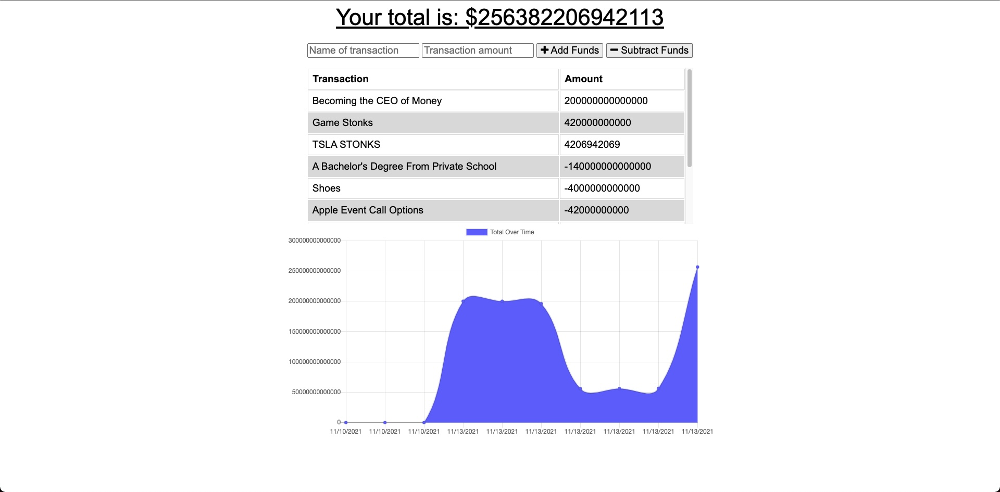

# PWA Budget Tracker

A Budget Tracker application that functions as a Progressive Web application.  Users can track their budget online and offline.

## Table of Contents

* [Installation](#installation)
* [Usage](#usage)
* [Links](#Links)
* [Features](#Features)

## Installation

1. Download or clone repository
2. `npm install` to install the required npm packages to run
3. `npm start` to run the application locally

## Usage

* Application will be invoked by using the following command:

  `node server.js`

* Open your browser and go to
  
  `http://localhost:3000`

* User can add transactions as deposits or expenses by inputting the following:
  * Name of the transaction
  * Transaction amount
  * For money in - select **Add Funds**
  * For money out- select **Subtract Funds**

* The total is adjusted when funds are added or subtracted.

* The graph will show the change in total balance for every transaction.

  

* The app can be used online and offline

* When brought back online:
  * Offline entries will be added to tracker

* You can download the app by pressing the download button (screenshot below)

  

## Links

* [Github]( LINK )
* [Live Heroku App]( LINK )

## Features

* Node
* Express
* JavaScript
* MongoDB
* Mongoose
* Progressive Web Application